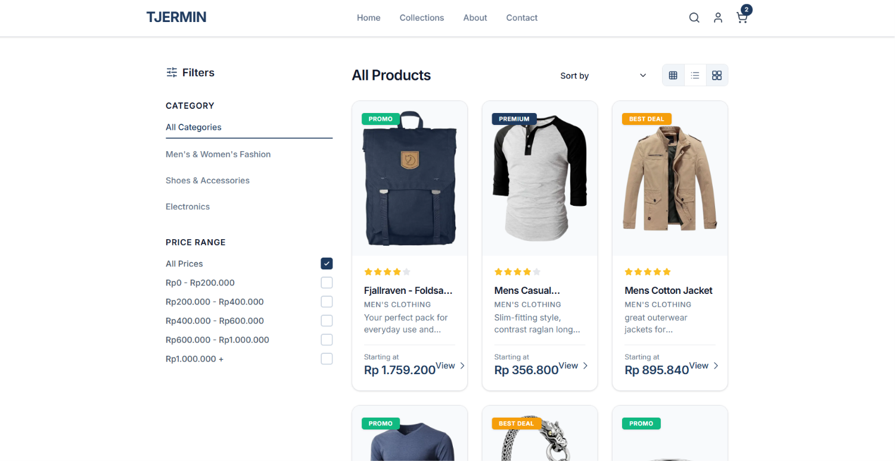
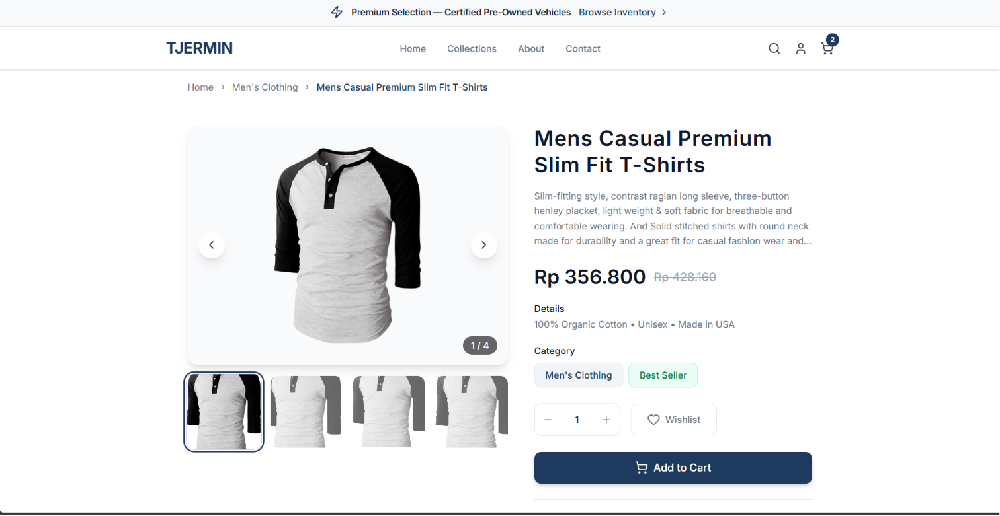
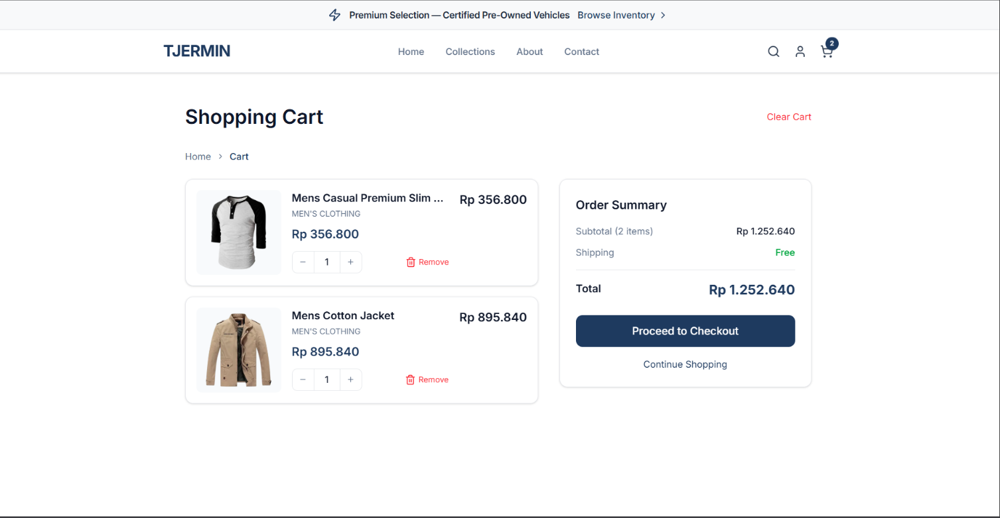
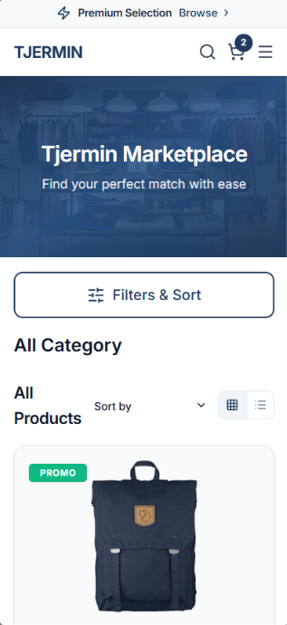
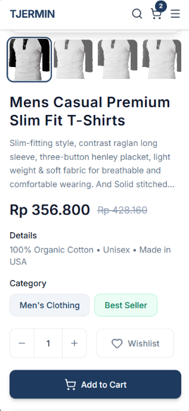
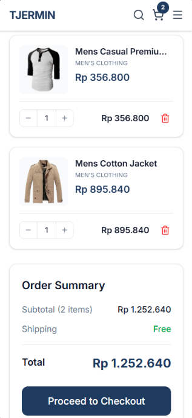

# TJermin Marketplace - Frontend Developer Technical Test

This repository contains a frontend technical test project for a Frontend Developer position. The project is an e-commerce marketplace application built with modern web technologies, demonstrating proficiency in Next.js, TypeScript, state management, and responsive design implementation.

The application fetches product data from FakeStore API and presents it through a clean, responsive interface with filtering capabilities, persistent cart functionality, and search features.

## Author

[](https://github.com/Kubagus)

[](https://www.linkedin.com/in/kubagus/)

[](mailto:ahmad@kubagus.my.id)

## Screenshots

### Web (Desktop)







### Mobile

| Homepage | Product Detail | Cart |
|----------|---------------|------|
|  |  |  |

## Technologies Used

This project leverages several modern technologies to demonstrate best practices in frontend development:

| Technology | Version | Purpose |
|------------|---------|---------|
| Next.js | 16.x | React framework providing Server Components, App Router, and optimized rendering strategies |
| TypeScript | 5.x | Static type checking to ensure code quality and better developer experience |
| Tailwind CSS | 4.x | Utility-first CSS framework for rapid and consistent UI development |
| Redux Toolkit | Latest | Predictable state container for managing cart and filter state across the application |
| redux-persist | Latest | Middleware for persisting Redux store to localStorage, ensuring cart data survives page refreshes |
| TanStack Query | Latest | Data fetching library with intelligent caching, stale-while-revalidate patterns, and error handling |
| Lucide React | Latest | Lightweight, consistent icon library for UI elements |
| FakeStore API | - | REST API providing product data for the marketplace |

## Installation Steps

Follow these instructions to set up the project locally on your machine.

### Prerequisites

Before beginning the installation process, ensure your development environment meets the following requirements:

- **Node.js**: Version 18 or higher is required. Version 22.x is recommended for optimal compatibility with Next.js 16.
- **npm**: Version 9 or higher (bundled with Node.js). Alternatively, you may use yarn or pnpm as your package manager.
- **Git**: Required for cloning the repository.

### Step 1: Clone the Repository

Open your terminal and execute the following command to clone the repository to your local machine:

```bash
git clone https://github.com/Kubagus/frontend-store-nextjs.git
```

Navigate into the project directory:

```bash
cd frontend-store-nextjs
```

### Step 2: Install Dependencies

Install all required npm packages by running:

```bash
npm install
```

This command reads the `package.json` file and installs all dependencies including Next.js, React, Redux Toolkit, TanStack Query, and other required packages. The installation process typically takes 1-2 minutes depending on your internet connection.

### Step 3: Configure Environment Variables

Create a `.env` file in the root directory of the project. This file will contain environment-specific configuration values.

```bash
# Create .env file
touch .env
```

Open the `.env` file and add the following configuration:

```env
NEXT_PUBLIC_API_URL=https://fakestoreapi.com
```

The `NEXT_PUBLIC_` prefix is required by Next.js to expose the variable to the browser. This variable defines the base URL for the FakeStore API endpoints used throughout the application.

### Step 4: Start Development Server

Launch the Next.js development server with the following command:

```bash
npm run dev
```

Once the server starts successfully, open your web browser and navigate to:

```
http://localhost:3000
```

The application will automatically reload when you make changes to the source code, providing a seamless development experience.

### Step 5: Build for Production

When you are ready to deploy or test the production build, execute:

```bash
npm run build
npm run start
```

The `build` command creates an optimized production build, and the `start` command serves the built application on port 3000.

## Project Structure

The project follows a feature-based architecture pattern, organizing code by domain rather than by type. This approach improves code discoverability and maintains clear boundaries between different features of the application.

```
frontend-store-nextjs/
├── app/                              # Next.js App Router directory
│   ├── layout.tsx                    # Root layout wrapping all pages with providers
│   ├── globals.css                   # Global styles, animations, and Tailwind configuration
│   ├── page.tsx                      # Homepage with product catalog
│   ├── not-found.tsx                 # Custom 404 page
│   ├── about/
│   │   └── page.tsx                  # About page
│   ├── blog/
│   │   └── page.tsx                  # Blog page
│   ├── cart/
│   │   └── page.tsx                  # Shopping cart page
│   ├── collections/
│   │   └── page.tsx                  # Collections page
│   ├── contact/
│   │   └── page.tsx                  # Contact page
│   ├── product/
│   │   └── [id]/
│   │       └── page.tsx              # Product detail with dynamic routing
│   └── shop/
│       └── page.tsx                  # Shop page
├── components/                       # Reusable UI components organized by feature
│   ├── cart/                         # Shopping cart functionality
│   │   └── CartClient.tsx            # Cart page with responsive layout
│   ├── filter/                       # Filtering functionality
│   │   ├── Sidebar.tsx               # Desktop sidebar with category and price filters
│   │   └── MobileFilterDrawer.tsx    # Mobile slide-out filter panel
│   ├── home/                         # Homepage-specific components
│   │   └── HomeClient.tsx            # Client component with TanStack Query fetching
│   ├── layout/                       # Application-wide layout components
│   │   ├── Navbar.tsx                # Navigation bar with search, cart badge, and mobile menu
│   │   ├── Footer.tsx                # Site footer with links and social icons
│   │   ├── Hero.tsx                  # Hero banner section
│   │   └── TopBanner.tsx             # Promotional top banner
│   ├── product/                      # Product-related components
│   │   ├── ProductCard.tsx           # Individual product card with hover animations
│   │   ├── ProductGrid.tsx           # Responsive product grid with sorting
│   │   ├── ProductDetail.tsx         # Legacy product detail (Server Component)
│   │   └── ProductDetailClient.tsx   # Product detail with client-side fetching
│   ├── search/                       # Search functionality
│   │   └── SearchModal.tsx           # Modal search with real-time filtering
│   └── ui/                           # Shared UI components
│       └── Newsletter.tsx            # Newsletter subscription section
├── hooks/                            # Custom React hooks
│   ├── index.ts                      # Typed Redux hooks (useAppDispatch, useAppSelector)
│   └── useProducts.ts                # TanStack Query hooks for product data fetching
├── lib/                              # Utility functions and API layer
│   └── api.ts                        # API functions with environment variable configuration
├── providers/                        # React Context providers
│   ├── ReduxProvider.tsx             # Redux store and persist-gate provider
│   └── QueryProvider.tsx             # TanStack Query client provider
├── store/                            # Redux state management
│   ├── index.ts                      # Store configuration with persistence setup
│   └── slices/
│       ├── cartSlice.ts              # Cart state: add, remove, update, clear
│       └── filterSlice.ts            # Filter state: category, price range
├── types/                            # TypeScript type definitions
│   └── index.ts                      # Product, CartItem, FilterState interfaces
├── public/                           # Static assets
├── .env                              # Environment variables (not committed to git)
└── package.json                      # Project dependencies and scripts
```

## Features

The application includes the following features that demonstrate modern frontend development practices:

### Core E-Commerce Features

- **Product Catalog**: Responsive product grid displaying items from FakeStore API with images, ratings, prices, and descriptions
- **Category Filtering**: Filter products by category (Men's & Women's Fashion, Shoes & Accessories, Electronics) with real-time updates
- **Price Range Filtering**: Filter products by price ranges in Indonesian Rupiah (IDR)
- **Product Detail Pages**: Dynamic routing with client-side fetching, image gallery with variations, and related products section

### Shopping Cart

- **Add to Cart**: Users can add products to the cart with quantity selection and loading animation
- **Persistent Cart**: Cart data persists across page refreshes using localStorage through redux-persist
- **Cart Management**: Update quantities, remove items, or clear the entire cart
- **Cart Badge**: Real-time cart item count displayed in the navigation bar with bounce animation
- **Order Summary**: Subtotal, shipping (free), and total calculation on the cart page
- **Responsive Layout**: Mobile-optimized layout with stacked items, desktop layout with side-by-side display

### Search Functionality

- **Modal Search**: Click the search icon to open a search modal overlay
- **Real-time Filtering**: Search products by name, category, or description as you type
- **Cached Results**: Product data is cached using TanStack Query for faster subsequent searches
- **Keyboard Navigation**: Press Escape to close the search modal
- **Result Preview**: Product thumbnails, names, categories, and prices displayed in search results

### Micro-Interactions and Animations

- **Product Card Hover**: Cards lift up with shadow enhancement and image zoom effect
- **Image Gallery**: Smooth transitions between product images with scale animations
- **Add to Cart Feedback**: Loading spinner animation, then green checkmark with "Added to Cart!" text
- **Wishlist Toggle**: Heart icon fills with red and scales when activated
- **Navigation Links**: Underline animation on hover for navigation items
- **Cart Badge**: Bounce animation when items are added
- **Page Transitions**: Fade-in animations for content loading
- **Quantity Controls**: Background color changes on hover for +/- buttons
- **Mobile Menu**: Slide animation for mobile navigation drawer

### Responsive Design

- **Mobile-First Approach**: Optimized layout for mobile devices with single-column product grid
- **Tablet Support**: Two-column product grid with adapted spacing
- **Desktop Layout**: Three-column product grid with sidebar filters
- **Mobile Filter Drawer**: Slide-out filter panel for mobile devices
- **Sticky Navigation**: Navigation bar remains visible while scrolling

## Handling Hydration Issues with Cart Persistence

One of the most significant technical challenges in this project involves managing hydration mismatches when implementing cart persistence with Redux and localStorage in Next.js. This section provides a detailed explanation of the problem and the solutions applied.

### Understanding the Hydration Problem

Next.js uses Server-Side Rendering (SSR) to render pages on the server before sending them to the client. During this process, React generates HTML on the server, and then the client "hydrates" this HTML by attaching event listeners and restoring client-side state.

The hydration mismatch occurs when the server-rendered HTML does not match what the client attempts to render. This is a common issue when using client-side storage mechanisms like `localStorage` with server-rendered applications.

In the context of cart persistence, the problem manifests as follows:

When a user adds items to their cart and refreshes the page, the server renders the application with an empty cart state because `localStorage` is not available on the server. However, when the client hydrates, `redux-persist` reads the cart data from `localStorage` and attempts to update the Redux store. This creates a discrepancy between the server-rendered empty cart and the client-side populated cart, resulting in a hydration warning:

```
Warning: Expected server HTML to contain a matching <div> in <div>.
```

### Why This Happens

The root cause is the fundamental difference between server and client environments:

1. **Server Environment**: The server has no access to browser APIs like `localStorage` or `window`. When Next.js renders the page server-side, the Redux store initializes with default values (empty cart).

2. **Client Environment**: After hydration, `redux-persist` reads the previously saved state from `localStorage` and merges it into the Redux store. This causes the cart to populate with items that were not present during server rendering.

3. **Mismatch Detection**: React compares the server-rendered HTML with the client-rendered HTML. When it detects differences (empty cart vs. populated cart), it logs a hydration warning.

### Implementation Solutions

The following solutions were implemented to resolve hydration issues while maintaining cart persistence:

#### Solution 1: Client-Side Data Fetching

All data fetching is performed on the client side using TanStack Query instead of Server Components. This approach ensures that API calls are made from the user's browser rather than from the server, which resolves deployment issues with external APIs.

```tsx
// components/home/HomeClient.tsx
"use client";

import { useProducts } from "@/hooks/useProducts";

export default function HomeClient() {
  const { data: products, isLoading, error } = useProducts();
  
  if (isLoading) return <LoadingSpinner />;
  if (error) return <ErrorMessage />;
  
  return <ProductGrid products={products} />;
}
```

#### Solution 2: Provider Architecture with useRef

The Redux provider and persist-gate are implemented using `useRef` to ensure that the store and persistor instances remain stable across re-renders. This prevents the creation of new instances on every render, which could cause additional hydration issues.

```tsx
// providers/ReduxProvider.tsx
"use client";

import { useRef } from "react";
import { Provider } from "react-redux";
import { PersistGate } from "redux-persist/integration/react";
import { persistStore } from "redux-persist";
import { makeStore } from "@/store";

export default function ReduxProvider({ children }: { children: React.ReactNode }) {
  const storeRef = useRef(makeStore());
  const persistorRef = useRef(persistStore(storeRef.current));

  return (
    <Provider store={storeRef.current}>
      <PersistGate loading={null} persistor={persistorRef.current}>
        {children}
      </PersistGate>
    </Provider>
  );
}
```

#### Solution 3: Redux Store Configuration with Persistence

The Redux store is configured with `redux-persist` using a specific setup that works harmoniously with Next.js:

```tsx
// store/index.ts
import { configureStore, combineReducers } from "@reduxjs/toolkit";
import { persistStore, persistReducer, FLUSH, REHYDRATE, PAUSE, PERSIST, PURGE, REGISTER } from "redux-persist";
import storage from "redux-persist/lib/storage";

const rootReducer = combineReducers({
  cart: cartReducer,
  filter: filterReducer,
});

const persistConfig = {
  key: "root",
  version: 1,
  storage,
  whitelist: ["cart"],  // Only persist cart state, not filter state
};

const persistedReducer = persistReducer(persistConfig, rootReducer);

export const makeStore = () =>
  configureStore({
    reducer: persistedReducer,
    middleware: (getDefaultMiddleware) =>
      getDefaultMiddleware({
        serializableCheck: {
          ignoredActions: [FLUSH, REHYDRATE, PAUSE, PERSIST, PURGE, REGISTER],
        },
      }),
  });
```

#### Solution 4: Safe localStorage Access Pattern

When components need to access `localStorage` directly, a mounted state pattern is used to ensure the component only renders client-side content after mounting:

```tsx
"use client";

import { useEffect, useState } from "react";
import { useAppSelector } from "@/hooks";

export default function CartBadge() {
  const [mounted, setMounted] = useState(false);
  const cartItems = useAppSelector((state) => state.cart.items);

  useEffect(() => {
    setMounted(true);
  }, []);

  // During SSR and initial render, show placeholder
  if (!mounted) return <span className="w-4 h-4" />;

  // After mounting, show actual cart count
  return <span>{cartItems.length}</span>;
}
```

### Summary of Hydration Handling Approach

The implementation uses a multi-layered approach to handle hydration issues:

| Layer | Technique | Purpose |
|-------|-----------|---------|
| Data Fetching | Client-side with TanStack Query | Avoids server-side API calls that may fail on deployment |
| Component Level | `"use client"` directive | Prevents server-side rendering of stateful components |
| Provider Level | `useRef` for store/persistor | Maintains stable instances across re-renders |
| Render Level | `PersistGate` with `loading={null}` | Delays rendering until state is rehydrated |
| State Level | `whitelist` in persist config | Only persists necessary state (cart) |
| Access Level | Mounted state pattern | Safe access to browser-only APIs |

## Routes

| Route | Description |
|-------|-------------|
| `/` | Homepage with product catalog, filtering, and hero section |
| `/product/[id]` | Product detail page with image gallery, add to cart, and related products |
| `/cart` | Shopping cart page with item management and order summary |
| `/shop` | Shop page (placeholder) |
| `/about` | About page (placeholder) |
| `/blog` | Blog page (placeholder) |
| `/contact` | Contact page (placeholder) |
| `/collections` | Collections page (placeholder) |

## Deployment

### Vercel Deployment

This project is configured for deployment on Vercel. The key configuration for successful deployment:

1. **Client-Side Data Fetching**: All API calls are made from the client side using TanStack Query, avoiding server-side fetch issues with external APIs.

2. **Dynamic Routes**: Product detail pages use `force-dynamic` rendering to ensure fresh data on each request.

3. **Environment Variables**: Set `NEXT_PUBLIC_API_URL=https://fakestoreapi.com` in the Vercel dashboard under Settings > Environment Variables.

## API Integration

This project utilizes the FakeStore API for product data. The following endpoints are consumed:

| Endpoint | Method | Description |
|----------|--------|-------------|
| `/products` | GET | Retrieves all products in the catalog |
| `/products/{id}` | GET | Retrieves a specific product by its identifier |
| `/products/categories` | GET | Retrieves all available product categories |
| `/products/category/{name}` | GET | Retrieves products filtered by category name |

The API base URL is configured through environment variables in the `.env` file, allowing for easy switching between development and production API endpoints.

## License

This project is submitted as a technical assessment for Frontend Developer position evaluation.
